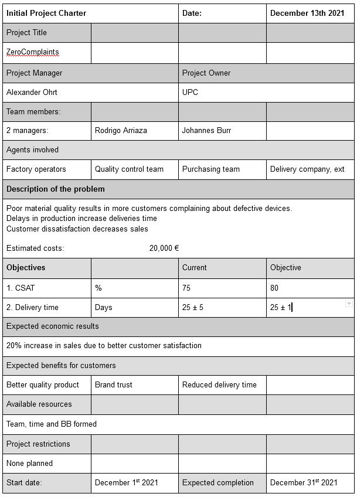
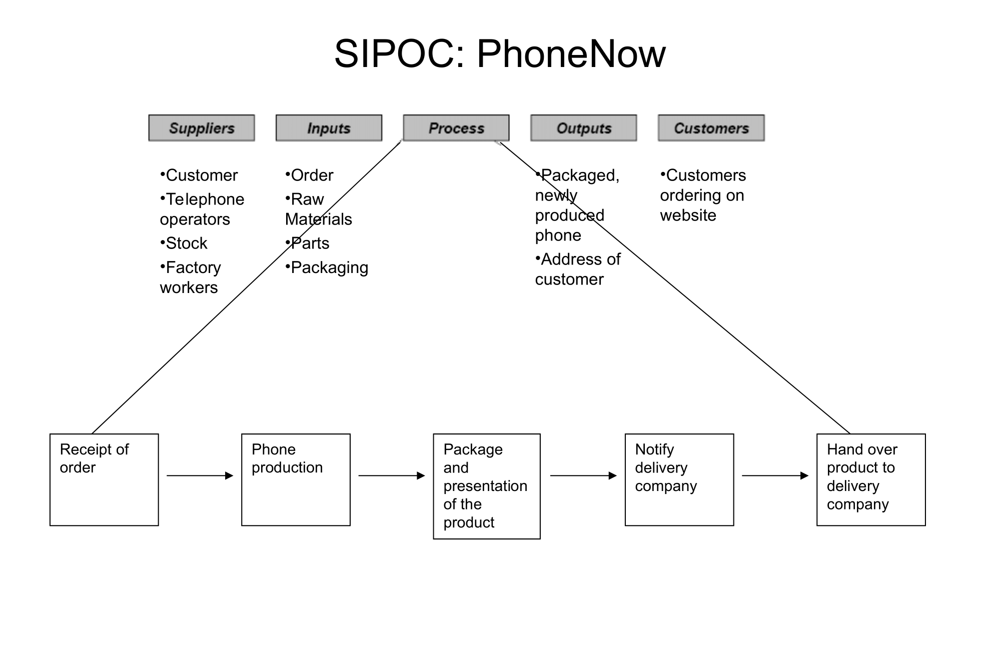

```{r setup, include=FALSE}
knitr::opts_chunk$set(echo = T, warning = F)
#setwd("/home/ajo/gitRepos/stat4BusMan/Assignment2")
```

# Background

PhoneNow is a small technology company, especially known for producing high quality phones at a low cost. Their business strategy is based on selling good quality phones to the low-end market. In this way they avoid the large market shares of Apple and Samsung in the luxury phone market. Their main competitors are Xiaomi, Nokia and Moto, among others. Moreover, they only sell products directly from their own website, and the products are made on-demand. In this way, their business does not require large amounts of capital, since they use capital they get directly from each customer for their costs. Also, they guarantee a production (and delivery) time of maximum one month, i.e. the customer should have their phone in their hand within one month. PhoneNow also guarantees customer satisfaction when it comes to the quality of the phone; if the phone is not to the quality that the customer expects, PhoneNow will make a new phone for the respective customer. 

Their business has been very successful the last couple of years, with market shares growing. However, the last two months they have received more complaints on production time and quality of their products than usual. This is why the Six-Sigma will be employed, with the goal of resolving some of the issues. The initial project was to reduce the number of complaints from the customers, both when it comes to production time and quality of the products. 

The Steering Committee estimated that the percentage of unsatisfied customers because of long production time with lower quality than expected was between 10\% and 15\%. A maximum level equal to 3\% was deemed as acceptable.

A team of 2 managers was launched, led by a Black Belt (BB), formed in the UPC.

# Define

## Clarify Purpose - Project Charter 


## SIPOC


## CTQ
The critical-to-quality (CTQ) target is that less than 3\% of the customers should be satisfied with the product they receive. Moreover, a critical-to-time (CTT) target is that less than 5\% of the customers should receive their product at a delayed time. 

## VoC
Using a survey published on our social media we:

* Confirmed and quantified what had already been discovered
* Found issues related to the quality of the phones (e.g. discovered general issues in quality, parts that are faulty more often than others, issues in packaging, etc.)
* Explored the possibility of offering additional services **(?)**

## Business Case
The annual turnover of PhoneNow digital shop is 100,000 €. 

The 15% of delayed production decreases the customer satisfaction by 20%.

It has been estimated that clients with a customer satisfaction below 6 will not buy a phone again from the company. This client churn results in losses of 20,000 €.

The estimations have been validated by the finance director. 

# Measure

## Questions to Answer

* How long does it take from order to shipment?
* How long does it take from shipment to delivery?
* How long does it take for a customer to receive his mobile device after he has finished the purchase?
* What percentage of clients file a complaint because of defective devices?

## Review Existing Data - Exploratory Data Analysis

The existing data for this business is simulated. 

```{r}
set.seed(1)
N=1000
# Production time. 
t_to_ship = rexp(N,1/2) + rnorm(N,15,2)

# Shipment time. 
t_ship = rexp(N,1/2) + rnorm(N,5,3)

total_times <- t_to_ship + t_ship
mu_tot <- mean(total_times)
sigma_tot <- sd(total_times)
```

We have data from `r N` customers during the last two months. The company provided us with production times and shipping times. The production times were collected by PhoneNow themselves, whereas the shipping times were collected by a third-party shipping company that PhoneNow has hired. The total time the customer has to wait for the product after placing an order is the sum of these two times. 

Moreover, the business provided us with customer satisfaction data, concerning the quality of the products **Not sure how I can simulate data and check six-sigma for this process? You do this (also doing it further down)**

```{r}
hist(t_to_ship, main = "Production Times", xlab = "Production time [days]", breaks = 100)
hist(t_ship, main = "Shipping Times", xlab = "Shipping time [days]", breaks = 100)
hist(total_times, main = "Total Times", xlab = "Time from order to customer receives [days]", breaks = 100)
abline(v = 30, col = "red", lty = 2)
```

A red dotted line is plotted to show where the guaranteed time is exceeded. The mean of the total time is `r round(mu_tot, 2)` and the standard error is `r round(sigma_tot,2)`.   

## Control Chart

We want to check if the process is out-of-control using the Six-Sigma criterion. The process is assumed to be optimal if the total time until the customer receives the product is distributed as $N(27, 1)$. 

```{r}
sigma_opt <- sqrt(1)
mu_opt <- 27
LSL <- (-6) * sigma_opt + mu_opt
USL <- 6 * sigma_opt + mu_opt
faults<-sum((total_times>USL)+(total_times<LSL))
```

The bounds LSL and USL in the Six-Sigma environment are calculated to being `r LSL` and `r USL`, respectively. Moreover, the number of faults in the total times is `r faults`, which means that the proportion of faults is `r round(faults/N, 2)`. Note that this shows that the estimations given by the Steering Committed from earlier are severely underestimated. This means that the observed process has `r faults/N*10^6` faults per million, i.e. it is a 2 sigma process and it is clearly out-of-control. This was determined from the Sigma Scale table. However, it can also be calculated that this is a 2 sigma process, as done in the code block below. 

```{r}
prob<-faults/N
(k<-qnorm(1-prob,1.5,1))
```

The control chart is shown below. 

```{r}
x <- seq(min(total_times), max(total_times), length = 100)
f1 <- dnorm(x, mean = mu_tot+1.5*sigma_tot, sd = sigma_tot)
f2 <- dnorm(x, mean = mu_tot, sd = sigma_tot)
hist(total_times,main = "Total Times", xlab = "Time from order to customer receives [days]", 
     breaks = 100, probability = T)
lines(x,f1,type="l",lwd=2,lty=2)
lines(x,f2,type="l",lwd=2,lty=1)
abline(v=LSL,lwd=2,lty=2)
abline(v=USL,lwd=2,lty=2)

DPMO<-1000000*(1-pnorm(USL,mu_tot+1.5*sigma_tot,sigma_tot))
```

The dotted lines vertical lines in the plot above show the bounds LSL and USL. The control chart above also clearly shows that the process is out of control, since there are times that are above USL and below LSL. Note that the times below LSL is not a problem when it comes to customer satisfaction, but it is a problem for PhoneNow, because it means that the variability in the production and shipping times is too large and they are not maximizing the potential returns in the company. The long term DPMO is `r DPMO`, which is large. 

```{r}
sigma<-(USL-mu_tot)/6
DPMO<-1000000*(1-pnorm(USL,mu_tot+1.5*sigma,sigma))

Cp_opt<-(USL-LSL)/(6*sigma_opt)
Cp<-(USL-LSL)/(6*sigma_tot)
```


In order to change the process to a Six-Sigma process, we need to reduce the standard deviation of the process from `r round(sigma_tot,2)` to `r round(sigma, 2)`. Note also that the optimal production capacity index is `r Cp_opt`, whereas the observed production capacity index is only `r round(Cp,2)`.


## Proposed Improvements

* Talk to the employees: Are they overworked? Do they not enjoy their work or the workplace? Teambuilding?
* Talk to the delivery company: Are they not doing their jobs to the best of their ability?
* Change delivery company?
* Change supplier of parts?


## Collect New Data After the Proposed Improvements

New data are "collected" (simulated) after testing the proposed improvements for 2 months. PhoneNow have decided to test using two different shipping companies, where they are hired to deliver half of the orders each. This is in order to mitigate the large variation seen in the shipping times from the original data. 

```{r}
set.seed(1)
N2 = 800 # A bit fewer orders than we had during the first two months. 

##### Data for production and shipping times. 
# Production time. 
t_to_ship_2 = rnorm(N2,23,1)

# two companies are used. maybe there's a difference
t_ship_comp1 <- rexp(N2/2,1/0.5) + rnorm(N2/2,2,1)
t_ship_comp2 = rexp(N2/2,1/1) + rnorm(N2/2, 3,3)

total_time = t_to_ship_2 + c(t_ship_comp1,t_ship_comp2) # company1 shipped the 1st half of phones, comp2 the 2nd


```

Now we have collected `r N2` orders. The new production, shipment (for both companies) and total times are shown in the histograms below. 

```{r}
hist(t_to_ship_2, main = "Production Times", xlab = "Production time [days]", breaks = 100)
hist(t_ship_comp1, main = "Shipping Times via Company 1", xlab = "Shipping time [days]", breaks = 100)
hist(t_ship_comp2, main = "Shipping Times via Company 2", xlab = "Shipping time [days]", breaks = 100)
hist(total_time, main = "Total Times", xlab = "Time from order to customer receives [days]", breaks = 100)
abline(v = 30, col = "red", lty = 2)
```

### Experiment Design - Do the Improvements Work?

The experiment we are doing to test the proposed improvements work is using the two following factors

* Compare delivery companies shipment-to-delivery times
* Compare \% defective phones by different [material] supplier

#### Testing Delivery Companies

Let's compare both shipment companies to see if we should prefer one over the other.

```{r}
wilcox.test(t_ship_comp1,t_ship_comp2)
median(t_ship_comp1) < median(t_ship_comp2)
```

In fact there is a significant difference between the delivery time of both companies. If possible, commissioning the first should be preferred. Since we had time on our hands, PhoneNow agreed to collect data for one more month after this test, only using the first shipping company in the test from above. 

```{r}
set.seed(1)
N3 = 1100 # A bit fewer orders than we had during the first two months. 

##### Data for production and shipping times. 
# Production time. 
t_to_ship_3 = rnorm(N3,23,1)

# two companies are used. maybe there's a difference
t_ship_com_final <- rexp(N3/2,1/0.5) + rnorm(N3/2,2,1.5)

total_time_final = t_to_ship_3 + t_ship_com_final
mu_tot_final <- mean(total_time_final)
sigma_tot_final <- sd(total_time_final)


```

This time, `r N3` orders were collected. The new data is visualized below. The mean of the total times is `r round(mu_tot_final, 2)` and the standard error is `r round(sigma_tot_final, 2)`.

```{r}
hist(t_to_ship_3, main = "Production Times", xlab = "Production time [days]", breaks = 100)
hist(t_ship_com_final, main = "Shipping Times via Best Company (Company 1)", xlab = "Shipping time [days]", breaks = 100)
hist(total_time_final, main = "Total Times", xlab = "Time from order to customer receives [days]", breaks = 100)
abline(v = 30, col = "red", lty = 2)
```

### Does the New Process Meet the Six-Sigma Criteria?

As earlier, we want to check if the process is out-of-control using the Six-Sigma criterion. The process is still assumed to be optimal if the total time until the customer receives the product is distributed as $N(27, 1)$. 

```{r}
faults2<-sum((total_time_final>USL)+(total_time_final<LSL))
```

The total faults in the new process, when it comes to total times, is `r faults2`, which means that the proportion of faults is `r round(faults2/N3, 2)`. This means that the observed process has `r faults2/N3*10^6` faults per million, i.e. it is a $\sim$ 4 sigma process and it is clearly out-of-control. This was determined from the Sigma Scale table. However, it can also be calculated that this is a $\sim$ 4 sigma process, as done in the code block below.  

```{r}
prob2<-faults2/N3
(k2<-qnorm(1-prob2,1.5,1))
```

This is clearly an improvement compared to the original process, but it is still not a Six-Sigma process. The control chart is shown below. 

```{r}
x2 <- seq(min(total_time_final), max(total_time_final), length = 100)
f11 <- dnorm(x2, mean = mu_tot_final+1.5*sigma_tot_final, sd = sigma_tot_final)
f21 <- dnorm(x2, mean = mu_tot_final, sd = sigma_tot_final)
hist(total_time_final,main = "Total Times", xlab = "Time from order to customer receives [days]", 
     breaks = 100, probability = T)
lines(x2,f11,type="l",lwd=2,lty=2)
lines(x2,f21,type="l",lwd=2,lty=1)
abline(v=LSL,lwd=2,lty=2)
abline(v=USL,lwd=2,lty=2)

DPMO<-1000000*(1-pnorm(USL,mu_tot_final+1.5*sigma_tot_final,sigma_tot_final))
```

The control chart above also shows that the process is out of control, since there are times that are above USL and below LSL. The long term DPMO is `r DPMO`, which is an improvement compared to earlier. 

```{r}
sigma<-(USL-mu_tot_final)/6
DPMO<-1000000*(1-pnorm(USL,mu_tot_final+1.5*sigma,sigma))

Cp_opt<-(USL-LSL)/(6*sigma_opt)
Cp<-(USL-LSL)/(6*sigma_tot_final)
```


In order to change the process to a Six-Sigma process, we need to reduce the standard deviation of the process from `r round(sigma_tot_final,2)` to `r round(sigma, 2)`. Again, note that the observed production capacity index is `r round(Cp,2)`, which is an improvement compared to earlier.

The conclusion is that the process of production and shipment is not a Six-Sigma after the best shipping company among two different ones was chosen. However, it is still an improvement compared to the original data, which is very important for PhoneNow. Further testing or further work with communication both internally and externally may help to reduce the standard error even more, until the process eventually reaches the goal of Six-Sigma. 

# I have left this down here because I do not know how to do it. You can do it.

The things concering the time is done, except for the Experiment Design (some more theory and explanations concerning that)

### Quality of Phones by 3x2 different Material Suppliers


In order to increase our market advantage, we designed a factorial experiment, in which we tested the effect of different supplier's materials on customer satisfaction.
Specifically, the touch display technology and the display's glass processed were identified as the main factors for user experience when handling a smartphone.
The company receives the glass either from the company "Gorilla Glass", "Special Glass" or "Simple Glass" and also the touch screen technology is ordered from two different suppliers "1" and "2".
75 individuals were recruited to test these 2x3 combination of PhoneNow's product and rated their satisfaction with the product on a 7-point Likert Scale. We conduct a classical Analysis of Variance to analyse the effects.


```{r}
set.seed(420)

# first simulate latent quality variables
q_gorilla = rnorm(N,0.8,0.2)
q_special = rnorm(N,0.85,0.1)
q_simple  = rnorm(N,0.77,0.3)


q_touch1 = rnorm(0.9,0.11)
q_touch2 = rnorm(0.8,0.25)

q_gorilla[q_gorilla < 0] <- q_special[q_special<0] <- q_simple[q_simple<0] <- 0
q_gorilla[q_gorilla > 1] <- q_special[q_special>1] <- q_simple[q_simple>1] <- 1
q_touch1[q_touch1<0] <- q_touch2[q_touch2<0] <- 0
q_touch1[q_touch1>1] <- q_touch2[q_touch2>1] <- 1

#init
phones_working = vector('numeric',6) 
M = 150 #each of the 6 cells gets 150 datapoints

for (i in 1:6){
  phones_working = sum( rbinom(M,1,q_touch1[1:M]) * rbinom(M,1,q_gorilla[1:M]))
}

## produces NaNs bc for loop wasn't executed as intented
# update: fixed removal of numbers > 1 and < 0 - Rodrigo


# TO DO:
# simulate customer satisfaction

# simple way

#csat <- round(rnorm(N, 6, 2)) # csat: from 0-10 how satisfied are you with your product?
#csat[csat>10] <- 10
#csat[csat<0] <- 0


# option b
# simulate customer sat as a function of delivery times and glass quality
csat.sim <- function() {
  gorilla.sample <- sample(q_gorilla, 334)
  special.sample <- sample(q_special, 333)
  simple.sample <- sample(q_simple, 333)
  df <- data.frame(list(total_t=total_times,
                        glass=c(rep('gorilla',334), rep('special',333),rep('simple',333)),
                        quality=c(gorilla.sample, special.sample, simple.sample)
                        ))
  df$csat <- -0.1*df$total_t + 10*df$quality + 1.5 # time decreases csat, quality increases it
  df$csat <- round((df$csat / max(df$csat)) * 10)
  df$csat[df$csat <0] <- 0
  #summary(df$csat)
  return(df)
}

```


```{r}
set.seed(420)
total = 75
likert_scale = vec=c(-Inf,-30,-20,-10,10,20,30,Inf)


s_gor_t1  = findInterval(rnorm(total,18.5,15),likert_scale)
s_gor_t2  = findInterval(rnorm(total,27,15),likert_scale)
s_spec_t1 = findInterval(rnorm(total,26,15),likert_scale)
s_spec_t2 = findInterval(rnorm(total,18.5,15),likert_scale)
s_simp_t1 = findInterval(rnorm(total,0,15),likert_scale)
s_simp_t2 = findInterval(rnorm(total,-10,15),likert_scale)

M=total
sat = c(s_gor_t1,s_gor_t2,s_spec_t1,s_spec_t2,s_simp_t1,s_simp_t2)
glass = c(rep(1,M),rep(1,M),rep(2,M),rep(2,M),rep(3,M),rep(3,M))
touch = c(rep(1,M),rep(2,M),rep(1,M),rep(2,M),rep(1,M),rep(2,M))

anov_data = data.frame(sat,as.factor(glass),as.factor(touch))
colnames(anov_data) = c("satisfaction","glass","touchscreen")


summary(aov(sat~glass*touch,data=anov_data))
```
As we can see both main effects for the glass and the touch screen technology processed as well as the interaction effect are statistically significant on a 5% level.
Therefore the nullhypothesis that these differences do not exist in the population can be rejected. Let's visually see, where these difference are, in order to conclude business recommendations.


```{r}
library("ggpubr")
ggboxplot(anov_data, x = "glass", y = "satisfaction", 
          color = "touchscreen",
          palette = c("#00AFBB", "#E7B800"),
          xlab="Glass Supplier")
```

In terms of the glass processed, the company SimpleGlass clearly provides the worst quality and should be excluded if possible.
Overall, GorillaGlass and SpecialGlass are of comparable quality. Interestingly, there is an interaction effect between these two glass materials and the touchscreen processed. When using GorillaGlass customers reported higher satisfaction with the product when combined with a touchscreen of company1. When using SpecialGlass, however, company2's touchscreen resulted in better average user experience.

The COVID19 pandemic revealed potential supply chain risks and reminded us of the advantages of spreading risk to multiple suppliers.
Therefore we recommend to use materials of both glass and touchscreen companies. However, we recommend to combine them in the above described optimal way.

